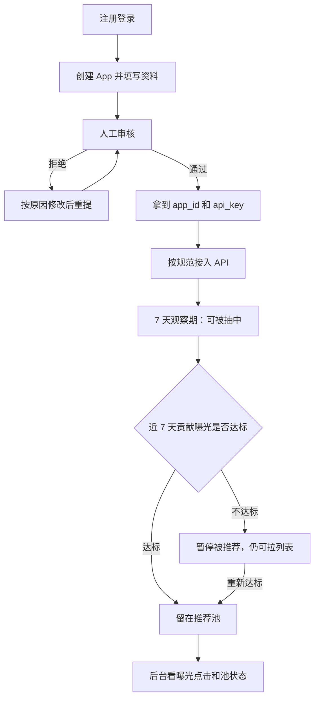

# PRD：AppUnions 应用互推联盟

| 字段 | 内容 |
| --- | --- |
| 产品中文名 | 应用互推联盟 |
| 产品英文名 | AppUnions |
| 文档版本 | V1.0 |
| 状态 | 草案 |
| 第一期范围 | Android、iOS、鸿蒙；纯免费互推 |

---

## 1. Summary

本文档定义 AppUnions（应用互推联盟）第一期要做成什么样。这是给独立 App 开发者用的交叉推广网络：开发者接入后，默认随机拉取最多 10 个同端 App，也可以查看全部 App；平台统计曝光和点击。

我们只提供三件事：开发者后台、API 接口、接入规范（含样式参考）。客户端 UI 由开发者自己写。第一期不做带界面的 SDK，也不做安装归因或付费加权。

---

## 2. Contacts

| 姓名 | 角色 | 说明 |
| --- | --- | --- |
| 待填 | 产品负责人 | 需求与优先级的最终解释人 |
| 待填 | 研发负责人 | 后台、API、数据统计的实现负责人 |
| 待填 | 运营 / 审核 | App 入驻审核、开发者沟通、联盟质量 |
| 待填 | 文档 / 设计 | 接入规范与样式参考 |

---

## 3. Background

### 这件事是什么

独立开发者想让更多人看到自己的 App。买广告很贵。找别的开发者一对一换量也很累：要加群、谈条件、各自埋点、事后对账。AppUnions 做成一个公共池。开发者接入一次，就能展示联盟里的其他 App，同时自己也有机会被别人展示。

### 为什么现在做

- 应用商店获客成本持续升高，中小开发者越来越难靠买量起步。
- 交叉推广本身并不新，但过去多靠私下换量或带 UI 的广告 SDK。前者难规模化，后者会抢走开发者对界面的控制。
- 现在用一套简单 API 就能完成「拉列表 + 报曝光 + 报点击」。开发者可以按自己 App 的风格做页面，接入成本比接一套广告 SDK 更低、也更透明。

### 第一期边界（已确认）

- 端：Android、iOS、鸿蒙。
- 模式：纯免费互推。入驻通过后，等权随机抽取，不做付费加权。
- 数据：只统计曝光和点击，不追踪是否安装成功。
- 客户端：只提供接口和样式参考，不提供带 UI 的官方 SDK。

---

## 4. Objective

### 目标

让独立开发者用很低的成本，稳定地获得来自其他 App 的真实曝光和点击；同时保证谁展示别人，谁才能被别人展示，避免联盟被「只被推、不展示」掏空。

这对开发者的好处：少花钱、少谈合作，也能把 App 亮给可能感兴趣的用户。

对公司的好处：先做成有质量的互推网络。网络越大，每个接入者越愿意留下。这是后续做增值能力（加权曝光、官方 SDK、归因）的基础。

这和产品方向一致：先把「接入简单、数据清楚、规则公平」做扎实，再谈变现。

### Key Results（上线后 90 天）

| KR | 指标 | 目标 | 说明 |
| --- | --- | --- | --- |
| KR1 | 通过审核的 App 数 | ≥ 50（三端合计） | 衡量网络是否启动 |
| KR2 | 日均有效曝光 | ≥ 10,000 | 去重后的有效展示次数，衡量真实流量 |
| KR3 | 联盟整体 CTR | ≥ 2% | 点击次数 / 有效曝光次数，衡量列表是否有用 |
| KR4 | 接入耗时 | 1 个工作日内可完成 | 按文档完成「拉列表 + 上报曝光和点击」 |

辅助观察（不作为 V1 成败线）：推荐池内 App 占比、因互惠门槛被暂停的 App 数、异常上报拦截次数。

---

## 5. Market Segment(s)

市场按「要完成的工作」划分，不按年龄或城市划分。

### 主市场：缺便宜获客渠道的独立开发者

他们已经有上架的 App，用户量不大或增长变慢。买量太贵，一对一换量找不到人或谈不拢。他们需要一个现成的互推池，接入后就能展示别人、也被别人展示。

典型场景：独立工具、效率、垂直内容、小游戏、个人作品。团队通常是 1～5 人。

### 次市场：想自己控制推荐页样式的开发者

他们不排斥互推，但讨厌广告 SDK 把难看的 Banner 或插屏塞进自己的 App。他们愿意自己画一页「发现」或「更多好用的 App」，只要接口清楚、数据能看。

### 约束

- 第一期只服务 Android、iOS、鸿蒙上的已上架应用。未上架、只有测试包的 App 不进入推荐池。
- 同端互推：Android 只推荐 Android，iOS 只推荐 iOS，鸿蒙只推荐鸿蒙。跨端跳转体验差，第一期不做。
- 不做 C 端用户账号。联盟对终端用户不可见为一个「产品品牌」，用户只看到宿主 App 自己的推荐页。
- 人工审核。第一期按约 50 个 App 的量级设计，不按应用商店级自动化审核设计。

---

## 6. Value Proposition(s)

### 开发者要完成的工作

- 在几乎不花钱的前提下，让更多人看到自己的 App。
- 用可控的方式给现有用户推荐其他 App，而不是被第三方广告控件破坏体验。
- 看清楚：自己贡献了多少展示，又获得了多少展示和点击。

### 他们会得到什么

- 一个现成的同端 App 池，不用自己去找合作对象。
- 默认一次随机最多 10 个 App，也可拉全部列表，方便做「换一批」和「查看全部」。
- 曝光、点击、CTR、近 7 / 30 天趋势，以及自己是否还在推荐池里。
- 自己写 UI，页面可以长得像自己的产品。

### 他们能躲开什么痛苦

- 不用逐个加开发者、谈曝光对等、私下对账。
- 不用接一套带广告外观的 SDK。
- 不用猜「展示了有没有被看见」：规则写明，数据在后台可见。

### 相对常见替代方案

| 维度 | 一对一私下换量 | 传统广告 / 交叉推广 SDK | 应用商店推荐位 | AppUnions |
| --- | --- | --- | --- | --- |
| 接入成本 | 高（每次重新谈） | 中高（SDK + 审核） | 不可控 | 低（四个接口） |
| 界面控制 | 双方各做各的 | 差（广告控件） | 无 | 完全由开发者做 |
| 费用 | 谈出来的对等条件 | 通常要花钱 | 难买到 | 第一期免费 |
| 数据 | 对账混乱 | 平台给，但不透明 | 几乎没有 | 曝光 + 点击，后台可看 |
| 公平性 | 靠人情 | 谁付钱谁优先 | 平台算法 | 等权随机 + 互惠门槛 |

价值曲线上，我们刻意做强三件事：**接入简单、界面自主、规则公平**。刻意不做三件事：带 UI 的 SDK、安装归因、付费买量。

---

## 7. Solution

### 7.1 UX / 用户流程

产品有两边：开发者后台（我们做），以及开发者自己 App 里的推荐页（他们做，我们给规范和样式参考）。

#### 开发者主路径

#### 终端用户路径（发生在开发者自己的 App 里）

1. 用户打开开发者做的「推荐 / 发现」页。
2. 宿主 App 请求随机推荐，最多 10 个同端 App，不含自己。
3. 卡片进入可视区域后，上报曝光。
4. 用户点击卡片或按钮，上报点击，并跳转商店或自定义链接。
5. 用户可点「换一批」（再次请求推荐）或「查看全部」（分页拉全量）。

#### 后台信息架构（V1）

- 登录
- 我的应用（列表、创建、编辑、暂停）
- 应用详情（资料、审核状态、凭证、是否在推荐池）
- 数据（曝光、点击、CTR、近 7 / 30 天）
- 接入文档入口

#### 推荐页样式参考（非强制组件）

开发者可自由改视觉，但建议至少包含：

- 列表卡片：图标、名称、一句话介绍、操作按钮（如「查看 / 下载」）
- 「换一批」：再次请求推荐接口
- 「查看全部」：走全量列表接口

不规定颜色、字体、布局框架。规范里放 1 张示意稿和字段对齐说明即可。

---

### 7.2 Key Features

#### 支柱 A：开发者后台

**注册与登录**

- V1 用邮箱注册 / 登录即可。
- 一个账号可创建多个 App。
- 不做团队成员、角色权限、SSO。

**应用入驻**

创建 / 编辑 App 时必填：

| 字段 | 说明 |
| --- | --- |
| 名称 | 展示给终端用户 |
| 图标 | 用于列表卡片 |
| 一句话介绍 | 建议不超过 30 个汉字 |
| 分类 | 从预设分类里选一个，便于以后筛选；V1 推荐接口不按分类定向 |
| 系统 | Android / iOS / 鸿蒙，创建后不可改 |
| 商店链接 | 对应系统的官方商店地址，审核必查 |

选填：

| 字段 | 说明 |
| --- | --- |
| 自定义跳转 | Android / iOS 的 deeplink，或鸿蒙 want。有则优先打开，失败再回落到商店链接 |

**审核**

状态机：`待审` → `通过` 或 `拒绝`；通过后可变为 `已暂停`。

- V1 人工审核。拒绝必须填写原因，开发者改完可再次提交。
- 审核看：是否真实上架、图标和名称是否一致、链接能否打开、有无明显违规（恶意扣费、色情、欺诈、冒充他人等）。
- 只有 `通过` 且未被暂停的 App，才可能进入推荐池。
- 运营可将已通过的 App 暂停（质量或作弊问题）。开发者也可自行暂停；暂停后不再被抽中，仍可调用拉列表和上报接口。

**凭证**

- 每个 App 有 `app_id` 和 `api_key`。
- `api_key` 只在创建时完整展示一次，之后可重置。重置后旧 key 立即失效。
- 请求必须带上该 App 的 key。服务端校验 key 与 `app_id`、系统类型一致。

**数据看板**

每个 App 至少展示：

- 获得的曝光、获得的点击、CTR（别人展示了自己）
- 贡献的曝光、贡献的点击（自己展示了别人）
- 近 7 天、近 30 天趋势
- 当前是否在推荐池、观察期剩余天数、距离互惠门槛还差多少曝光

V1 不做 CSV 导出（放到 V1.1）。

---

#### 支柱 B：API 服务

第一期只提供四类接口。鉴权：请求头携带 `api_key`。所有列表接口按宿主 App 的系统过滤，并排除自己。

**1. 随机推荐**

- `GET /v1/apps/recommend`
- 从推荐池中等权随机抽取，最多 10 条；池里不足 10 条则有多少返回多少。
- 可传 `limit`，上限 10，默认 10。
- 每次请求重新抽，供「换一批」使用。
- 不保证无重复跨请求；同一响应内不得重复。

**2. 全量列表**

- `GET /v1/apps`
- 返回该端所有「已通过且未暂停」的 App，含暂未进入推荐池的（例如观察期未达标）。这样「查看全部」仍然完整。
- 必须分页。建议默认每页 20，最大 50。
- V1 不提供分类筛选（V1.1 再加）。

**3. 曝光上报**

- `POST /v1/events/impressions`
- 支持一次上报多条。每条必须包含被展示的 `app_id`。
- 产品定义：卡片进入可视区域后再报。仅拉取列表、未真正展示，不算曝光。
- 同一宿主、同一被展示 App，短时间重复上报可去重（具体窗口由技术设计定，产品要求：不能靠刷接口虚增）。

**4. 点击上报**

- `POST /v1/events/clicks`
- 一次一条。必须包含被点击的 `app_id`。
- 产品定义：用户点了卡片或按钮后再报，然后跳转。
- 点击对应的 App 应来自近期拉过的列表；明显乱报的点击可丢弃。

**单条 App 返回字段（产品级）**

`id`、名称、图标 URL、一句话介绍、分类、系统、商店链接、自定义跳转（可空）。

**错误（产品级，细节由技术设计补全）**

- 未鉴权 / key 无效
- App 未通过审核
- 参数不合法
- 上报的目标 App 不存在或不属于该端
- 触发频率限制

---

#### 公平抽量规则（V1 必做）

纯免费互推如果人人都能被抽中、却不必展示别人，网络会垮。因此：

1. **同端互推**：按宿主 App 的系统过滤。
2. **排除自己**：推荐和全量列表都不包含宿主 App。
3. **等权随机**：推荐池内每个 App 被抽中的概率相同。第一期没有权重、没有类目定向、没有付费插队。
4. **互惠门槛**：
   - 新 App 审核通过后进入 **7 天观察期**。观察期内可以被抽中。
   - 观察期结束时：近 7 天 **有效贡献曝光 ≥ 100**，才能留在推荐池。
   - 之后按滚动 7 天检查。低于门槛则暂停被推荐，仍可拉列表和上报。重新达标后自动回到池中。
   - 「有效贡献曝光」指通过反作弊校验后的、展示他人的曝光。
5. **开发者暂停或运营暂停**：立即出池。

门槛数字 100 / 7 天是起步值。上线后若大量正常小流量 App 被误伤，或刷量仍容易达标，应调整。调整属于运营参数，不需要改接口形态。

---

#### 反作弊（V1 基础版）

- 校验 `api_key` 与宿主 App 绑定，系统类型必须一致。
- 曝光、点击里的 `app_id` 必须是真实存在的同端 App，且不能是自己。
- 限制单 App 的上报频率。短时间海量曝光视为无效。
- 异常 CTR（例如点击远大于曝光，或接近 100% 且量大）进入人工复查，可暂停被推荐。
- 同一宿主对同一目标的曝光按时间窗口去重。

V1 不要求设备指纹级防刷。先挡住明显接口刷量。

---

#### 支柱 C：接入规范与样式参考

对外文档必须让一个熟悉自己平台的开发者，在 1 天内接完。至少包括：

1. 接入步骤：注册 → 建 App → 等审核 → 拿 key → 拉推荐 → 展示 → 报曝光 / 点击。
2. 鉴权方式和四个接口的字段说明。
3. 曝光、点击的上报时机（可视区、点击后再跳转）。
4. 三端打开方式：优先自定义跳转，失败则打开商店链接。
5. 错误码和处理建议。
6. 样式参考：卡片结构、建议字段用法、「换一批 / 查看全部」的交互说明。明确写：UI 由开发者实现，样式参考不是强制组件。
7. 公平规则说明：观察期、互惠门槛、同端、排除自己。避免开发者误以为「接入就能一直被推荐」。

---

#### V1 明确不做

- 不提供带 UI 的官方 SDK、Flutter / RN 插件、开箱即用页面。
- 不做安装、注册、付费归因，也不对接各应用商店的转化回传。
- 不做付费加权、类目定向、人群定向、地域定向。
- 不做开发者之间的一对一换量撮合或合同。
- 不做终端用户登录或跨 App 用户识别。
- 不做消息推送、评论、点赞、开发者社区。

---

### 7.3 Technology

本 PRD 不规定语言、云厂商或数据库。实现时需要满足：

- 推荐接口在常规流量下响应快，随机抽取不能明显偏向某一批 App。
- 曝光、点击上报允许短暂延迟落库，但不能丢到影响日统计的程度。
- `api_key` 按密钥管理，可重置、可失效。
- 统计按天可查，支持 7 天和 30 天。
- 三端只是 App 上的系统字段和跳转约定，不要求第一期提供原生 SDK。

详细技术方案另开文档。

---

### 7.4 Assumptions

以下是我们相信、但尚未验证的判断。做的过程中要主动核对：

| 编号 | 假设 | 若不成立会怎样 |
| --- | --- | --- |
| A1 | 开发者愿意为互推单独做一页 UI，而不坚持要带 UI 的 SDK | 接入意愿下降，可能需要提前做极简示例工程 |
| A2 | 人工审核在约 50 个 App 的量级可以撑住 | 审核排队变长，需要加审核人或收紧入驻 |
| A3 | 只统计曝光和点击，对开发者已经有决策价值 | 开发者会要求安装数；需在文档里把边界讲清楚 |
| A4 | 商店链接 + 可选自定义跳转，足够完成三端打开 | 某端打开失败多，需要补该端的打开约定 |
| A5 | 互惠门槛（7 天 100 次有效曝光）能挡住白嫖，又不会误伤正常小 App | 需要把门槛做成可调参数并观察 |
| A6 | 等权随机在冷启动期可接受，开发者不会强烈要求按类目匹配 | 若投诉多，将类目筛选提前到 V1.1 |
| A7 | 第一期用邮箱账号即可，开发者不需要团队协作功能 | 工作室账号共用一个邮箱也能先用 |

---

## 8. Release

不写具体日历日期。按相对时间排期。

### V1（约 4～6 周）— 可对外拉开发者接入

必须交付：

- 开发者后台：注册登录、App 入驻、人工审核、凭证、暂停、数据看板、推荐池状态
- 四个 API：随机推荐（最多 10）、全量分页、曝光批量上报、点击上报
- 公平规则：同端、排除自己、观察期、互惠门槛、等权随机
- 基础反作弊：鉴权绑定、频率限制、曝光去重、异常 CTR 复查
- 接入规范 + 样式参考

完成标准：外部开发者只靠文档，能在 1 天内接到自己的 App 里，并在后台看到自己上报的数据和被他人展示的数据。

### V1.1（V1 稳定后约 2～4 周）

- 数据导出
- 全量列表的分类筛选
- 更细的作弊规则和审核记录
- 可选：各端一份最小可运行示例（仍不是带 UI 的官方 SDK）

### 以后（不做进 V1 承诺）

- 官方 SDK / 跨端插件
- 付费加权曝光
- 安装归因
- 按类目或相似度推荐（不只是随机）
- 团队成员与角色
- 开发者社区或一对一换量

### 风险与依赖

- **冷启动**：池子太小，每次只能抽出两三个 App，开发者会觉得没价值。需要运营先集中邀请一批质量尚可的 App 同期接入。
- **白嫖**：只想被展示、自己把推荐页藏起来。靠互惠门槛和观察期缓解，不能靠信任。
- **刷量**：假曝光会污染排行和门槛。V1 先挡接口刷量，发现规模作弊再升级。
- **审核质量**：违规 App 进池会伤害所有接入者的用户。宁可不快，也不要放松商店链接和内容底线。
- **三端差异**：鸿蒙跳转、国内 Android 多商店链接可能比 iOS 更麻烦。文档必须按端写清，审核时按端验收。

---

## 附录：名词

| 名词 | 含义 |
| --- | --- |
| 宿主 App | 正在调用 API、向用户展示列表的那个 App |
| 推荐池 | 当前可以被随机抽中的 App 集合 |
| 观察期 | 审核通过后的前 7 天，期间可被抽中 |
| 互惠门槛 | 近 7 天有效贡献曝光 ≥ 100，否则暂停被推荐 |
| 有效曝光 | 通过反作弊校验、且发生在可视展示之后的曝光 |
| CTR | 点击次数 / 有效曝光次数 |
