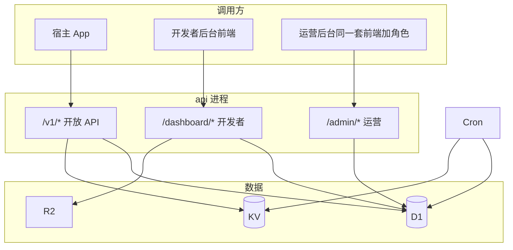
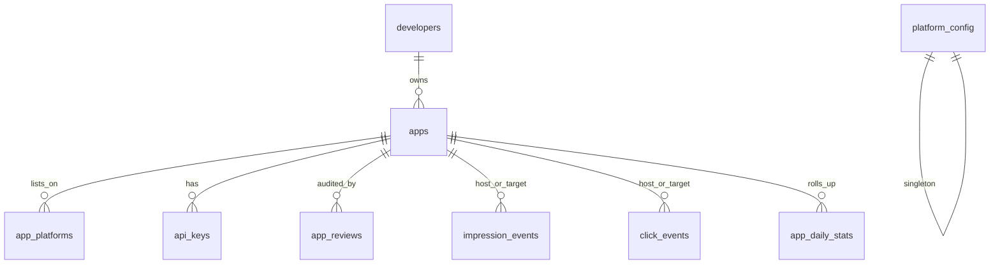
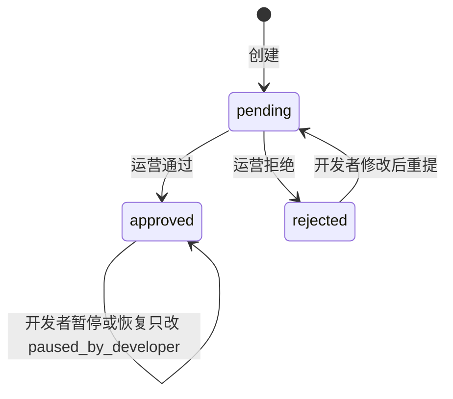

# 技术方案：AppUnions 后端（V1）

| 字段 | 内容 |
| --- | --- |
| 对应产品 | [PRD-appunions.md](PRD-appunions.md) |
| 完整设计 | [TECH-appunions.md](TECH-appunions.md)（Web 后台、文档站、运营台、部署） |
| 范围 | 后端：开放 API、开发者后台 API、运营审核、统计、推荐池、基础反作弊 |
| 不在本文 | Web 页面交互、接入文档正文、样式参考稿（见完整设计） |
| 状态 | 待评审（技术栈已确认：Cloudflare Workers + D1 + KV + R2） |

本文给后端评审用。整站怎么拼、有哪些页面，看完整设计。先看第 1 节选型，再看第 4 节模型和第 6～8 节三条主链路。文末是待拍板的决策。

---

## 1. 目标与约束

V1 后端要同时撑住三件事：

1. 开发者 App 用 `api_key` 拉列表、报曝光、报点击。
2. 开发者在网页后台管 App、看数据。
3. 运营审核 App、必要时暂停。

规模按 PRD 的 90 天目标设计，并留一点余量：

- 约 50～200 个 App
- 日曝光 1 万～10 万
- 推荐接口 P95 &lt; 200ms
- 上报接口允许短暂延迟落库，但不能丢到影响「当天数据」

这个量级不需要消息队列、不需要分析型仓库。单库 PostgreSQL 足够。优先把规则做对：同端、排除自己、观察期、互惠门槛、key 只存哈希。

---

## 2. 技术选型（已确认）

| 层 | 选择 | 原因 |
| --- | --- | --- |
| 运行时 | Cloudflare Workers | 不再自建 1Panel / Node 长进程 |
| 语言 | TypeScript | 和后台前端同语言，接口类型可共享 |
| HTTP | Hono | Workers 上的轻量路由，和 Fetch API 对齐 |
| 主库 | D1 | SQLite，和 Worker 同进程绑定 |
| 缓存 / 限流 | KV | 验证码、限流、推荐池 ID 列表 |
| 对象存储 | R2 | App 图标 |
| 开发者登录 | 邮箱验证码，JWT（access 15min + refresh 30d，httpOnly cookie） | V1 不做 SSO、不做团队成员 |
| 开放 API 鉴权 | 查询参数 `app_id`（宿主 UUID） | 客户端直连，不需要 API Key |
| 后台任务 | 同一 Worker 的 Cron Triggers | 量小，先不引入独立队列 |
| ORM | Drizzle | schema 即文档，迁移可读 |
| 校验 | Zod | 请求体、查询参数统一校验 |

部署形态：一个 Worker 同时托管 `apps/web` 静态资源和 API。生产同一域名：`/v1`、`/dashboard`、`/admin`、`/health`、`/media` 进 Hono，其余进 Web。页面路径不得占用这些前缀（页面用 `/apps`、`/docs`、`/ops`）。

**明确不选（V1）**

- Cloudflare 以外的自建 VPS / 1Panel：生产只跑在 Workers + D1 + KV + R2。
- Kafka / SQS / ClickHouse：日 10 万事件量级用不上。
- 带 UI 的 SDK、安装归因、设备指纹。
- 多租户分库、读写分离。

---

## 3. 总体架构



三个 HTTP 面共用一个进程、同一数据库，鉴权不同：

| 前缀 | 调用方 | 鉴权 | 失败时 |
| --- | --- | --- | --- |
| `/v1` | 宿主 App | 查询参数 `app_id` → 解析出宿主 App | 401 / 403 |
| `/dashboard` | 开发者 | 登录 JWT，只能碰自己的 App | 401 / 403 |
| `/admin` | 运营 | 登录 JWT 且 `role = admin` | 401 / 403 |

开放 API 和后台 API 不要混用同一套权限中间件。

---

## 4. 数据模型

### 4.1 ER 关系



### 4.2 表

**developers**

| 列 | 类型 | 说明 |
| --- | --- | --- |
| id | uuid PK | |
| email | citext unique | 登录名 |
| password_hash | text | |
| role | text | `developer` / `admin`，V1 运营账号也放这张表 |
| created_at | timestamptz | |

**apps**

| 列 | 类型 | 说明 |
| --- | --- | --- |
| id | uuid PK | 对外的 `app_id` |
| developer_id | uuid FK | |
| name | text | |
| icon_url | text | 存储完成后的 HTTPS URL |
| tagline | text | 一句话，最长 30 汉字（按 Unicode 字素校验） |
| category | text | 大分类名称 |
| subcategory | text | 小分类名称 |
| review_status | text | `pending` / `approved` / `rejected` |
| paused_by_developer | bool | 默认 false |
| paused_by_ops | bool | 默认 false |
| rejected_reason | text null | |
| approved_at | timestamptz null | 观察期起点 |
| in_recommend_pool | bool | 由 worker 维护，推荐接口只读这个标记 |
| contributed_impressions_7d | int | 由 worker 维护，有效贡献曝光 |
| created_at / updated_at | timestamptz | |

可见性（给「全量列表」用）的判定不单独存列，查询时算：

```
review_status = 'approved'
AND paused_by_developer = false
AND paused_by_ops = false
```

推荐池比可见性多互惠规则，见第 7 节。`in_recommend_pool` 是物化结果，避免每次 `GET /recommend` 现算 7 天窗口。

**app_platforms**

一个 App 可配置多个端。同一 `(app_id, platform)` 唯一；同一端的 `package_name` 全局唯一。

| 列 | 类型 | 说明 |
| --- | --- | --- |
| id | uuid PK | |
| app_id | uuid FK | |
| platform | text | `android` / `ios` / `harmonyos` |
| package_name | text | Android applicationId / iOS Bundle ID / 鸿蒙 bundleName |
| created_at | timestamptz | |

**api_keys**

| 列 | 类型 | 说明 |
| --- | --- | --- |
| id | uuid PK | |
| app_id | uuid FK | 每个 App 当前只有 1 条有效 |
| key_prefix | text | 如 `auk_live_ab12`，后台展示用 |
| key_hash | text unique | SHA-256 hex |
| created_at | timestamptz | |
| revoked_at | timestamptz null | 重置时写上 |

明文 key 格式：`auk_live_` + 32 字节 CSPRNG 的 base32。创建和重置时只在响应里回一次。库中永不存明文。

校验：`hash(provided) → 查 api_keys` → `revoked_at IS NULL` → load `apps`。

**app_reviews**

每次审核动作一行，便于以后追责（V1.1 可做审核记录页）。

| 列 | 说明 |
| --- | --- |
| id, app_id, actor_id | 运营 developer id |
| action | `approve` / `reject` / `ops_pause` / `ops_resume` |
| reason | 拒绝、暂停时必填 |
| created_at | |

**impression_events**（有效曝光明细）

| 列 | 说明 |
| --- | --- |
| id | uuid |
| host_app_id | 宿主 |
| target_app_id | 被展示 |
| client_id | 客户端匿名 ID，见决策 D1 |
| idempotency_key | 客户端生成，同一 key 只收一次 |
| occurred_at | 服务端收到时间 |
| accepted | bool，false 表示校验失败仍审计留下？（V1 建议失败不落这张表，只打日志） |

唯一约束：`(host_app_id, idempotency_key)`。

索引：

- `(host_app_id, occurred_at)` 贡献侧统计
- `(target_app_id, occurred_at)` 获得侧统计
- `(host_app_id, target_app_id, client_id, occurred_at)` 去重查询

**click_events**

列与曝光类似：`host_app_id, target_app_id, client_id, idempotency_key, occurred_at`。

额外规则：同一 `(host, target, client_id)` 在最近 24h 内必须有一条有效曝光，否则丢弃点击（不 4xx 打扰客户端，返回 `accepted: false`）。

**app_daily_stats**

按天预聚合，看板不扫明细。

| 列 | 说明 |
| --- | --- |
| app_id, day | PK |
| impressions_received | 别人展示我 |
| clicks_received | |
| impressions_given | 我展示别人 |
| clicks_given | |

写入路径：事件被接受后，同一事务里 `INSERT ... ON CONFLICT DO UPDATE`。worker 也可以每天对账重算，作为兜底。

**platform_config**（单行）

| 列 | 默认 | 说明 |
| --- | --- | --- |
| grace_days | 7 | 观察期 |
| reciprocity_impressions | 100 | 近 7 天有效贡献曝光门槛 |
| impression_dedup_minutes | 30 | 同一 client 对同一目标的曝光去重窗 |
| recommend_cache_seconds | 30 | 每端推荐池 ID 缓存 |
| rate_recommend_per_min | 60 | |
| rate_impressions_per_min | 120 | 按条数计，不是按请求计 |
| rate_clicks_per_min | 60 | |
| rate_list_per_min | 60 | |

门槛是运营参数，改这一行即可，不用发版。

**分类**：`categories` 表存两级（`parent_id` 为空是大分类）。应用上存名称 `category` / `subcategory`。运营可在「分类」页增删改；创建应用时点输入框提示已有项，也可输入还不存在的分类，保存时写入目录。

---

## 5. App 状态



运营暂停改 `paused_by_ops`，不改 `review_status`。

四层能否出现在接口里：

| 条件 | 全量列表 | 推荐池 |
| --- | --- | --- |
| pending / rejected | 否 | 否 |
| approved，被开发者或运营暂停 | 否 | 否 |
| approved，观察期内 | 是 | 是 |
| approved，观察期后，7 日贡献 ≥ 门槛 | 是 | 是 |
| approved，观察期后，7 日贡献 &lt; 门槛 | 是 | 否 |

`in_recommend_pool` 只表示最后一行里的「是」。开发者暂停和运营暂停由查询可见性时直接过滤，worker 写池标记时也必须把它们算进去，避免推荐缓存脏读。

---

## 6. 开放 API（`/v1`）

公共约定：

- HTTPS only
- JSON
- 时间 ISO-8601 UTC
- 查询参数 `app_id`：宿主应用 UUID（客户端直连，不要 API Key）
- 已拒绝、`app_id` 缺失或无效：开放 API 一律不可用（含上报）
- 审核中（`review_status = pending`）：可用同一 `app_id` 拉结构相同的 mock 列表（响应根上 `mock: true`），曝光/点击对 mock id 返回 accepted 但不写入统计；通过后自动切真实推荐池

查询参数 `app_id` 是宿主；曝光/点击请求体里的 `app_id` 是列表里的目标应用。

### 6.1 错误码

| HTTP | code | 何时 |
| --- | --- | --- |
| 400 | `invalid_params` | 校验失败 |
| 401 | `unauthorized` | 缺 `app_id` / 不是合法 UUID / 应用不存在 |
| 403 | `app_not_approved` | 宿主已被拒绝 |
| 403 | `app_paused_by_ops` | 运营暂停宿主（仍不允许调用，避免作弊号继续报量） |
| 404 | `target_not_found` | 上报目标不存在 |
| 429 | `rate_limited` | 超限 |
| 500 | `internal_error` | |

开发者自行暂停后：**仍允许**拉列表和上报（PRD）。仅运营暂停时封禁开放 API。这一点和「暂停后不出现在别人列表里」是两件事。

响应形状：

```json
{ "error": { "code": "unauthorized", "message": "Invalid API key" } }
```

### 6.2 `GET /v1/apps/recommend`

Query：`app_id` 必填（宿主 UUID）；`platform` 必填（`android` / `ios` / `harmonyos`）；`limit` 默认 10，最小 1，最大 10。

逻辑：

1. 鉴权，校验宿主已配置请求的 `platform`。
2. 读 Redis `pool:{platform}`（TTL = `recommend_cache_seconds`）。没有则从 DB 拉 `id WHERE in_recommend_pool AND 存在该端 app_platforms`，写入 Redis。
3. 从列表去掉宿主自己。
4. Fisher–Yates 洗牌，取 `limit` 条。池更小则全返回。
5. 用 ID 批量查 App 展示字段（可再加一层 30s 的详情缓存）。
6. 写一条「最近下发」记录到 Redis：`recent:{host_app_id}` = 本次 ID 列表，TTL 24h，供点击校验（见 8.3）。V1 只保留最近 3 次请求的并集，避免「换一批」后旧点击全部失效。

同一响应内 ID 不重复。不保证跨请求不重复。

审核中（`pending`）跳过推荐池：返回固定 mock 目录，响应根上带 `mock: true`，不写 `recent:{host}`。

V1 池子最多几百个 ID，洗牌在内存做。不要 `ORDER BY random()` 全表扫。

### 6.3 `GET /v1/apps`

Query：`app_id` 必填（宿主 UUID）；`platform` 必填；`page` 从 1，`page_size` 默认 20，最大 50。

过滤：该端已填包名、可见（已通过且两种 pause 都为 false）、排除自己。

排序：`created_at DESC, id DESC`（稳定分页）。V1 无分类筛选。

响应：`{ items, page, page_size, total }`。审核中同样返回 mock，并带 `mock: true`。

### 6.4 展示字段（recommend 与 list 共用）

```json
{
  "id": "uuid",
  "name": "...",
  "icon_url": "https://...",
  "tagline": "...",
  "category": "工具",
  "subcategory": "文件管理",
  "platform": "android",
  "package_name": "com.company.app"
}
```

不要返回开发者邮箱、审核状态、是否在池中、统计数字。

### 6.5 `POST /v1/events/impressions`

Query：`app_id` 必填（宿主 UUID）。

```json
{
  "platform": "android",
  "client_id": "uuid",
  "impressions": [
    { "app_id": "uuid", "idempotency_key": "uuid", "visible": true }
  ]
}
```

- 单次最多 10 条（对齐一屏推荐上限）。
- `visible` 必须为 true，否则整条丢弃。这是契约：客户端承诺「进入可视区」后才报。服务端无法验证可视区，只作字段约束。
- 逐条判定，响应：

```json
{
  "results": [
    { "app_id": "...", "idempotency_key": "...", "accepted": true },
    { "app_id": "...", "idempotency_key": "...", "accepted": false, "reason": "duplicate" }
  ]
}
```

单条 `accepted: false` 仍返回 HTTP 200。鉴权失败才 401。审核中对 mock id 返回 `accepted: true`，不写事件表、不计入统计。

拒绝 reason（产品可不对外文档化全部，但服务端要稳定）：

| reason | 含义 |
| --- | --- |
| `self` | 目标是自己 |
| `platform_mismatch` | 不同端 |
| `not_visible_in_catalog` | 目标未通过 / 被暂停 |
| `duplicate` | 幂等 key 已存在，或去重窗内同一 client+target |
| `rate_limited` | 本条因限流丢弃（也可整请求 429，见下） |

整请求超限：429。已进入处理的部分条数以限流中间件为准——更简单的做法是：**先限流再处理**，超限整包拒绝，避免半成功。

### 6.6 `POST /v1/events/clicks`

Query：`app_id` 必填（宿主 UUID）。请求体 `app_id` 是被点击的目标应用。

```json
{
  "platform": "android",
  "client_id": "uuid",
  "app_id": "uuid",
  "idempotency_key": "uuid"
}
```

一次一条。响应 `{ "accepted": true }` 或 `{ "accepted": false, "reason": "no_recent_impression" }`。审核中对 mock id 同样 accepted 且不记账。

---

## 7. 推荐池 worker

每 5 分钟跑一次（V1 可接受最多 5 分钟延迟进出池）。

伪逻辑：

```
对每个 review_status = approved 的 App:
  visible = !paused_by_developer && !paused_by_ops
  given_7d = COUNT impression_events
             WHERE host_app_id = app.id
               AND occurred_at >= now() - 7 days
  in_grace = approved_at != null && now() < approved_at + grace_days
  in_pool = visible && (in_grace || given_7d >= reciprocity_impressions)
  更新 contributed_impressions_7d, in_recommend_pool
刷新后 DEL Redis pool:android / pool:ios / pool:harmonyos
```

`given_7d` 只计已经 `accepted` 的有效曝光。

开发者暂停、运营暂停、审核通过：在写库的 API 里立刻把该 App 的 `in_recommend_pool` 更新掉，并删对应平台缓存。不要干等到下一轮 worker，避免已下架 App 还被抽中。

看板展示：

- `in_recommend_pool`
- `grace_days_left = max(0, approved_at + grace_days - now)`
- `reciprocity_gap = max(0, threshold - contributed_impressions_7d)`

---

## 8. 上报、去重、反作弊

没有设备指纹。V1 只挡「拿 key 刷接口」。

### 8.1 必须带 `client_id`

这是对 PRD 的补充，见文末决策 **D1**。

- 客户端生成 UUID，存在本地，卸载前保持不变。
- 这不是用户账号，服务端不把 `client_id` 当登录态。
- 去重键：`(host_app_id, target_app_id, client_id)` + 时间窗。

没有 `client_id` 就只能按「整个宿主 App」去重，真实用户的曝光会被压成 1 次。所以 V1 把 `client_id` 设为必填。

### 8.2 曝光去重

顺序：

1. 幂等：`(host_app_id, idempotency_key)` 已存在 → `duplicate`，不双计。
2. 窗口：过去 `impression_dedup_minutes`（默认 30）内，同一 `(host, target, client_id)` 已有有效曝光 → `duplicate`。
3. 通过则插入 `impression_events`，并 upsert 当天 `app_daily_stats`（host 的 given +1，target 的 received +1）。

实现：窗口去重用 KV，key = `imp:{host}:{target}:{client}`，TTL = 去重分钟。同时写 D1。KV 说重复则不写库；D1 唯一约束挡住重试双写。

### 8.3 点击校验

全部满足才 `accepted`：

1. 目标同端、不是自己、当前可见（在全量列表口径里）。
2. 幂等 key 未用过。
3. 该 `client_id` 在 24h 内对该 target 有有效曝光。
4. target 出现在该宿主最近 3 次 recommend/list 下发集合里（Redis `recent:{host}`）。list 分页请求也要把当页 ID 并入这个集合。
5. 通过则写 `click_events`，双方日统计 `clicks_* + 1`。

第 4 条用来挡「随便报一个联盟里的 app_id」。第 3 条用来挡「没展示就点击」。

### 8.4 限流（Redis 固定窗口即可）

按 `app_id`（宿主）：

| 接口 | 默认 |
| --- | --- |
| recommend | 60 次 / 分钟 |
| list | 60 次 / 分钟 |
| impressions | 120 条 / 分钟 |
| clicks | 60 次 / 分钟 |

超限 429，`Retry-After: 60`。

### 8.5 异常 CTR（worker，每天一次）

对每个 App，用近 7 天 **获得侧** 数据：

- `clicks_received > impressions_received`，或
- `impressions_received >= 200` 且 `CTR >= 0.5`

写入 `anomaly_flags`（简表：app_id, type, window, created_at, resolved_at）。V1 不做自动封禁，只给运营列表。运营决定是否 `paused_by_ops`。

---

## 9. 开发者后台 API（`/dashboard`）

鉴权：邮箱密码登录，JWT cookie。所有 App 操作先查 `apps.developer_id = me`。

| 方法 | 路径 | 说明 |
| --- | --- | --- |
| POST | `/dashboard/auth/register` | 邮箱、密码；V1 先不强制邮箱验证（决策 D2） |
| POST | `/dashboard/auth/login` | |
| POST | `/dashboard/auth/logout` | |
| GET | `/dashboard/auth/me` | 当前用户 `{ id, email, role, superAdmin }`，Web 刷新页面用 |
| GET | `/dashboard/categories` | 两级分类目录，供创建应用时提示 |
| GET | `/dashboard/apps` | 我的 App 列表。每条带摘要：`icon_url, platforms, review_status, paused_*, in_recommend_pool, grace_days_left, impressions_received_7d` |
| POST | `/dashboard/apps` | 创建，`multipart`（名称、描述、分类、图标）。生成 api_key，**响应里明文只出现这一次** |
| GET | `/dashboard/apps/:id` | 资料 + `platforms` + 审核状态 + key_prefix + 池状态 + 门槛缺口 |
| PATCH | `/dashboard/apps/:id` | 改名称/描述/分类。已通过的资料变更是否重新进审核：见 D3 |
| PUT | `/dashboard/apps/:id/platforms` | 覆盖该 App 的端与包名。`{ platforms: [{ platform, packageName }] }` |
| POST | `/dashboard/apps/:id/resubmit` | 拒绝后重提，`review_status → pending`，清 `rejected_reason` |
| POST | `/dashboard/apps/:id/pause` | `paused_by_developer = true`，立刻出池、出全量列表 |
| POST | `/dashboard/apps/:id/resume` | 仅当 `paused_by_ops = false` |
| POST | `/dashboard/apps/:id/api-key/rotate` | 旧 key 立刻 `revoked_at`，新明文只回一次 |
| POST | `/dashboard/apps/:id/icon` | multipart，校验 mime 为 png/jpeg/webp，最大 512KB，上传对象存储 |
| GET | `/dashboard/apps/:id/stats` | query `range=7d\|30d` |

**stats 响应**

```json
{
  "range": "7d",
  "impressions_received": 0,
  "clicks_received": 0,
  "ctr_received": 0,
  "impressions_given": 0,
  "clicks_given": 0,
  "in_recommend_pool": true,
  "grace_days_left": 4,
  "reciprocity_threshold": 100,
  "contributed_impressions_7d": 12,
  "reciprocity_gap": 88,
  "series": [{ "day": "2026-09-01", "impressions_received": 0, "clicks_received": 0, "impressions_given": 0, "clicks_given": 0 }]
}
```

CTR：`impressions_received == 0` 时返回 `null`，不要算成 0 造成误解。

创建后 `review_status = pending`。客户端用 `app_id` 即可调 `/v1`。审核中开放 API 返回 mock 测试数据（不计曝光）；运营通过当天起返回真实推荐。已拒绝仍返回 `app_not_approved`。

---

## 10. 运营 API（`/admin`）

`role = admin` 的账号走同一登录接口，前端根据 `role` 和 `superAdmin` 显示运营台。超级管理员邮箱写死为 `cmlanche@qq.com`（seed 会确保该用户存在且 `role=admin`）。普通管理员由超管在后台搜索已注册用户后把 `developers.role` 改成 `admin`；登录时不再按邮箱名单覆盖角色。普通管理员可以审核和改门槛，不能调用用户管理接口。

| 方法 | 路径 | 说明 |
| --- | --- | --- |
| GET | `/admin/apps?status=pending` | 审核队列 |
| GET | `/admin/apps/:id` | 含各端包名、图标，供人工核对 |
| POST | `/admin/apps/:id/approve` | 写 `approved_at = now()`（仅首次通过时），进观察期 |
| POST | `/admin/apps/:id/reject` | body `{ reason }` 必填 |
| POST | `/admin/apps/:id/pause` | `paused_by_ops`，reason 必填 |
| POST | `/admin/apps/:id/resume` | |
| GET | `/admin/anomalies` | 异常 CTR 列表 |
| GET | `/admin/config` | 读门槛参数 |
| PATCH | `/admin/config` | 改门槛；改完立刻触发一次全量池重算 |
| GET | `/admin/categories` | 分类树（含应用占用数） |
| POST | `/admin/categories` | `{ name, parentId? }` 新增大类或小类 |
| PATCH | `/admin/categories/:id` | 改名，并同步已有应用上的名称 |
| DELETE | `/admin/categories/:id` | 未使用才可删；大类需先删小类 |
| GET | `/admin/users?q=` | 超管：搜索/列出已注册用户 |
| PATCH | `/admin/users/:id` | 超管：`{ role: "admin" \| "developer" }`，不能改超管本人 |

拒绝后再通过：若 `approved_at` 已有值，**不重置观察期**（避免反复拒绝来刷观察期）。仅 `approved_at IS NULL` 时写入。若产品希望每次通过都重新观察，改这一行即可。

---

## 11. 事务与一致性

| 场景 | 策略 |
| --- | --- |
| 曝光 / 点击接受 | 单事务：插事件 + upsert 日统计 |
| 重置 key | 单事务：旧行 revoke + 插入新哈希 |
| 审核通过 | 单事务：改 apps + 插 app_reviews + 置 in_recommend_pool |
| 池缓存 | DB 提交成功后再删 Redis。缓存允许 30s 脏，可接受 |
| Redis 去重 vs PG | PG 唯一约束是真相；Redis 只是加速窗口去重 |

日统计若和明细不一致：worker 每天凌晨用明细重算昨天（及前天，防跨日延迟）。看板以 `app_daily_stats` 为准。

---

## 12. 安全

- 密码：Argon2id 或 bcrypt cost ≥ 10。
- `api_key` 只存哈希；日志、错误信息、看板都只打 `key_prefix`。
- 开放 API 不返回其他开发者的邮箱、暂停原因、统计。
- 图标：服务端转存，不信客户端传来的外链当主图（创建时也可以先填 URL，但 V1 只允许上传，避免 SSRF 去拉图）。
- CORS：`/v1` 对浏览器开放 `Access-Control-Allow-Origin: *`（客户端直连，无密钥）。`/dashboard` 生产同域，不依赖跨域。开发环境由 Vite 代理到 `wrangler dev`。
- 限流对开放 API 必须有；登录接口按 IP + email 限流，防爆破。
- 管理接口不暴露到文档站点。
- 不在客户端 bundle 任何服务端密钥。

---

## 13. 可观测性

日志字段：`request_id, surface(v1|dashboard|admin), app_id, code, latency_ms`。禁止打 key 明文、密码、email 可按需哈希。

指标：

- `recommend_latency_ms`
- `events_accepted_total{type=impression|click}`
- `events_rejected_total{reason}`
- `rate_limited_total`
- `pool_size{platform}`
- `pending_review_count`

健康检查：`GET /health` 查 D1。

---

## 14. 测试要点（后端）

优先自动化这些，比堆 CRUD 测试有用：

1. 推荐：只出同端、不含自己、不含暂停、不含观察期后未达标。
2. 推荐：同一响应无重复；limit 上限 10。
3. 全量列表：观察期未达标的 App 仍出现；开发者暂停的不出现。
4. 曝光：自推、跨端、未过审目标 → accepted false。
5. 曝光：同一 idempotency_key 只计 1 次。
6. 曝光：同一 client+target 在去重窗内第 2 次不计。
7. 点击：无近期曝光 → false；有曝光且在 recent 列表 → true。
8. key 重置后旧 key 401。
9. 未过审宿主调 `/v1` → 403。
10. worker：贡献跨过门槛后 `in_recommend_pool` 变为 true；降到门槛下变为 false。
11. 运营暂停后，该 App 立刻从推荐缓存消失。

---

## 15. 目录建议（实现时）

```
apps/web          Vite React：开发者后台、文档、运营台
apps/api          Hono Worker：/v1 /dashboard /admin + Cron
packages/db       Drizzle schema + D1 迁移
packages/shared   Zod 类型、分类枚举、错误码
```

不要把服务端密钥写入前端；开放 API 只用 `app_id`，接入页可用同源 `/v1` 做预览，不计后台代发曝光。

---

## 16. 实施顺序

全栈顺序见 [TECH-appunions.md](TECH-appunions.md) 第 13 节。后端可按该顺序的接口部分并行：schema → 登录/`me` → 创建 App → 审核 → `/v1` 列表 → 上报与日统计 → worker → 限流。

---

## 17. 待拍板（评审请先看这里）

| ID | 决策 | 本文默认 | 备选 |
| --- | --- | --- | --- |
| D1 | 上报是否强制 `client_id` | **强制**。否则无法按用户去重曝光 | 不收 client_id，只做幂等 + 整 App 限流，统计会偏粗 |
| D2 | 注册是否验证邮箱 | V1 **不验证**，尽快接入 | 接入 Resend/SES 后再加 |
| D3 | 已通过 App 改名称/图标/包名 | **不自动打回待审**，运营抽查 | 改关键字段则回到 pending，更安全更烦 |
| D4 | 开发者暂停后开放 API | **可用**（PRD） | 一并封禁，更狠但影响接入调试 |
| D5 | 运营暂停后开放 API | **不可用** | 仍可用，只是自己不出现在别人列表 |
| D6 | 点击必须命中 recent 下发列表 | **是** | 只要同端可见即可，实现简单但更好刷 |

**已拍板（不再讨论）**

- 后端：Cloudflare Workers + Hono + D1 + KV + R2。

D1、D3、D6 对安全和数据质量影响最大，建议先定这三项再写代码。
