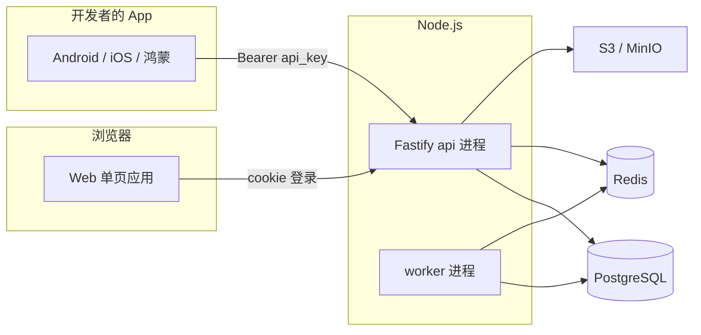
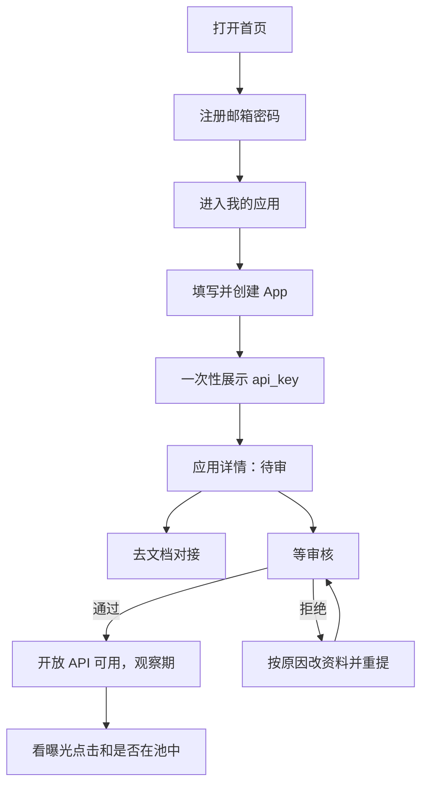

# 技术方案：AppUnions 完整设计（V1）

| 字段 | 内容 |
| --- | --- |
| 对应产品 | [PRD-appunions.md](PRD-appunions.md) |
| 后端细节 | [TECH-appunions-backend.md](TECH-appunions-backend.md)（数据模型、开放 API、推荐池、反作弊） |
| 本文范围 | 整站：Web 后台、接入文档站、运营台，以及它们如何和 Node 后端拼在一起 |
| 状态 | 待评审 |

V1 对外交付的是一套网站 + 一套开放 API，不是「只有后端」。开发者在网站上注册、建 App、等审核、复制密钥、读文档；宿主 App 再调 `/v1`。运营在同一套网站里审核。

---

## 1. 产品面（V1 要做齐）

| 面 | 给谁 | 形态 |
| --- | --- | --- |
| 开发者后台 | 独立开发者 | Web，要登录 |
| 接入文档 / 样式参考 | 开发者（可未登录阅读） | Web，公开页 |
| 运营台 | 内部审核 | Web，同一站点，`role = admin` 才看见 |
| 开放 API | 宿主 App | HTTP JSON，`api_key`，无网页 |

不做：带 UI 的客户端 SDK、C 端用户站、独立运营后台域名（V1 同一套前端即可）。

---

## 2. 系统怎么拼



生产建议 **一个域名、反向代理分流**，避免 cookie 跨站，也避免前端路由和 API 撞车：

| 路径前缀 | 交给谁 | 说明 |
| --- | --- | --- |
| `/v1/*` | Fastify | 开放 API |
| `/dashboard/*` | Fastify | 开发者后台 API |
| `/admin/*` | Fastify | 运营 API |
| `/health` | Fastify | 探活 |
| 其它所有路径 | Web 静态资源 | SPA，前端路由 |

因此 **页面路径不要用 `/dashboard`、`/admin`、`/v1`**。页面用 `/apps`、`/docs`、`/ops`。

本地开发：Vite 把上述 API 前缀代理到 Fastify（如 `localhost:3000`），前端跑 `localhost:5173`。Cookie 在开发环境设 `SameSite=Lax`；生产同域后同样适用。

---

## 3. 技术栈

已确认不用 Cloudflare。整站都跑在自己的 Node / 静态托管上。

| 层 | 选择 |
| --- | --- |
| Web | React 18 + TypeScript + Vite + React Router |
| UI | Tailwind CSS + 少量自研后台组件（表格、表单、对话框）。不引入很重的中台套件 |
| 图表 | 轻量折线图（如 uPlot 或 Recharts），只用于 7/30 天趋势 |
| 文档 | 仓库内 Markdown，构建时打进前端路由 `/docs/*` |
| 后端 | Node.js 20 + Fastify + PostgreSQL + Redis + S3，见后端文档 |
| 仓库 | 单仓 monorepo：`apps/web`、`apps/api`、`apps/worker`、`packages/*` |

Web **不写业务规则**（是否在推荐池、去重、审核状态机都在服务端）。前端只展示接口返回值，并做表单校验、空态、权限显隐。

---

## 4. 角色与权限（页面层）

| 角色 | 来源 | 能进的页面 |
| --- | --- | --- |
| 未登录 | 无 cookie | 登录、注册、公开文档 |
| 开发者 | `role = developer` | 我的应用、应用详情、数据、文档 |
| 运营 | `role = admin` | 开发者能进的全部 + `/ops/*` |

未登录访问 `/apps` → 跳 `/login?next=...`。开发者访问 `/ops` → 403 页（「没有权限」），不要伪装成 404。

会话：

1. 注册 / 登录成功，Fastify 写 httpOnly cookie（access + refresh）。
2. 前端启动时 `GET /dashboard/auth/me`，拿到 `{ id, email, role }`。
3. 401 则清本地用户态，跳登录。
4. 登出：`POST /dashboard/auth/logout`，跳 `/login`。

V1 不验证邮箱、不找回密码（与后端 D2 一致）。忘记密码文案写「联系运营」，避免做一半的邮件链路。

---

## 5. 信息架构

```
公开
  /                    首页（一句话 + 注册/登录 + 链到文档）
  /login
  /register
  /docs                接入说明首页
  /docs/api            四个开放接口
  /docs/rules          同端、观察期、互惠门槛
  /docs/ui             样式参考
  /403

登录后（开发者）
  /apps                我的应用
  /apps/new            创建应用
  /apps/:id            应用详情（资料 / 凭证 / 状态）
  /apps/:id/stats      数据

登录后（运营额外）
  /ops/review          审核队列
  /ops/apps/:id        审核详情
  /ops/anomalies       异常 CTR
  /ops/config          门槛参数
```

顶栏：产品名、文档、邮箱、退出。运营多一个「审核」。

侧栏仅登录后出现：我的应用、接入文档。运营再加：审核、异常、参数。

---

## 6. 关键用户流程

### 6.1 开发者从注册到接入



创建成功后 **必须** 用模态框展示完整 `api_key`，提供复制按钮，关闭后永远只显示 `key_prefix + ****`。文案写死：「请立即保存，离开后无法再看明文。」重置密钥走同一套模态框。

### 6.2 运营审核

1. 进 `/ops/review`，默认筛 `pending`。
2. 打开详情：图标、名称、简介、端、商店链接（新标签打开）、deeplink、开发者邮箱。
3. 通过 / 拒绝（拒绝必须填原因）/ 暂停（必须填原因）。
4. 回到队列，下一条。

### 6.3 终端用户（不在我们的 Web 里）

发生在开发者自己的 App。Web 只通过文档告诉他们怎么做。流程见 PRD：拉最多 10 条 → 可视区报曝光 → 点击上报并跳转 → 换一批 / 查看全部。

---

## 7. 页面说明

每页写：目的、主操作、空/错态、调用的接口。接口形态以 [后端文档](TECH-appunions-backend.md) 为准。

### 7.1 首页 `/`

目的：让人 10 秒内知道这是免费互推联盟，并去注册。

- 一句话：接入后展示别人的 App，自己也有机会被展示。
- 按钮：注册、登录、读文档。
- 不放营销长文。不做 SEO 专项（V1 可索引但不必做落地页体系）。

### 7.2 注册 `/register`、登录 `/login`

| 字段 | 规则 |
| --- | --- |
| 邮箱 | 必填，前端格式校验，最终以后端为准 |
| 密码 | 至少 8 位 |

- 注册成功即登录并跳 `/apps`（或 `next`）。
- 邮箱已存在：提示去登录，不要泄露「是否注册过」以外的信息。
- 登录失败：统一「邮箱或密码不对」。
- 登录接口限流时展示「试太多次，请稍后再试」。

接口：`POST /dashboard/auth/register`、`POST /dashboard/auth/login`。

### 7.3 我的应用 `/apps`

表格列：图标、名称、端、审核状态、是否在推荐池、获得曝光（近 7 天）、操作。

状态徽章：

| 展示 | 条件 |
| --- | --- |
| 待审核 | `review_status = pending` |
| 已拒绝 | `rejected` |
| 观察期 | 已通过且 `grace_days_left > 0` |
| 推荐中 | `in_recommend_pool = true` 且不在观察期文案优先用「推荐中」；观察期也可同时标注 |
| 未达互惠 | 已通过、不在池、且非暂停 |
| 已暂停 | `paused_by_developer` |
| 运营暂停 | `paused_by_ops`（开发者只读原因或固定文案「运营已暂停，请联系我们」） |

空态：还没有 App，主按钮「创建应用」。

接口：`GET /dashboard/apps`。若列表不带近 7 天曝光，详情再查；列表接口应带摘要字段，避免 N+1。**后端列表响应需包含**：`id, name, icon_url, platform, review_status, paused_by_developer, paused_by_ops, in_recommend_pool, grace_days_left, impressions_received_7d`。

### 7.4 创建应用 `/apps/new`

表单：

| 字段 | 必填 | 说明 |
| --- | --- | --- |
| 名称 | 是 | |
| 图标 | 是 | png/jpeg/webp，≤ 512KB，先本地预览，提交时 `POST .../icon` 或创建接口支持 multipart |
| 一句话介绍 | 是 | 实时数汉字，上限 30 |
| 分类 | 是 | 下拉，文案用中文，值用后端枚举 |
| 系统 | 是 | Android / iOS / 鸿蒙，创建后不可改，旁边写一句「选错只能再建模」 |
| 商店链接 | 是 | URL |
| 自定义跳转 | 否 | 占位符按端变化（deeplink / want） |

提交：`POST /dashboard/apps` → 成功进密钥模态框 → 确认后去 `/apps/:id`。

失败：校验错误贴在字段下；500 用页顶提示。

建议创建分两步也可，V1 **一页提交** 更少流失。图标若需先有 `app_id`：先 `POST` 资料（icon 可暂空）再立刻 `POST /icon`，任一步失败要在页上说明「应用已创建但图标未传，请到详情页补传」。更干净的做法是创建接口走 `multipart` 一次完成。完整设计采用 **一次 multipart 创建**，详情页仍保留单独换图标。

### 7.5 应用详情 `/apps/:id`

锚点分区，单页不要拆太多子路由（数据除外）。

**状态条（最上方，必看）**

用后端字段拼一句人话，例如：

- 待审：「审核中，通过前开放接口会返回未通过。你可以先按文档写代码。」
- 拒绝：红条 + `rejected_reason` + 按钮「修改并重新提交」。
- 通过 + 观察期：「观察期还剩 N 天。请尽快在 App 里真实展示列表并上报曝光，否则到期会暂时离开推荐池。」
- 通过 + 缺口：「还差 N 次有效曝光才能回到推荐池。全量列表里别人仍可能看到你。」
- 开发者暂停：「已暂停，不会出现在别人的列表里。开放接口仍可用。」
- 运营暂停：「运营已暂停本应用，开放接口不可用。」

**资料**

与创建表单相同，系统字段只读。保存 `PATCH /dashboard/apps/:id`。拒绝态保存后走 `POST .../resubmit`（或保存即重提，按钮文案写成「保存并重新提交」）。

**凭证**

- `app_id` 可复制。
- `api_key` 只显示前缀。按钮「重置密钥」→ 二次确认（旧 key 立刻失效）→ 明文模态框。
- 示例：`Authorization: Bearer <你的密钥>`。

**开关**

- 暂停 / 恢复。运营暂停时禁用恢复，提示联系运营。

接口：`GET /dashboard/apps/:id`、`PATCH`、`resubmit`、`pause`、`resume`、`api-key/rotate`、`icon`。

### 7.6 数据 `/apps/:id/stats`

- 切换 7 天 / 30 天。
- 四张数字：获得曝光、获得点击、贡献曝光、贡献点击；CTR（无比数时显示「—」）。
- 是否在推荐池、观察期剩余、门槛、已贡献、缺口（与详情状态条重复也可以，数据页要自洽）。
- 一张按日折线图，四条序列可开关。

空数据：应用刚建完也要能打开，全 0 + 「通过并接入后这里会有数」。

接口：`GET /dashboard/apps/:id/stats?range=7d|30d`。

### 7.7 文档 `/docs/*`

公开，不登录也能读。登录态顶栏不变。

必须有四章（对应 PRD 支柱 C）：

1. **接入步骤**：注册 → 建 App → 等审核 → 拿 key → 拉推荐 → 可视区报曝光 → 点击后上报再跳转。
2. **API**：Base URL、鉴权、四个接口的请求/响应/错误码。从 `packages/shared` 生成或手写，但要和实现一致。
3. **规则**：同端、排除自己、观察期 7 天、近 7 天 100 次贡献曝光、开发者暂停 vs 运营暂停。
4. **样式参考**：卡片 = 图标 + 名称 + 一句话 + 按钮；「换一批」打 recommend；「查看全部」打分页全量。标明「不是强制组件，但曝光点击必须报」。给一张线框示意（静态图即可）。

文档里的门槛数字写「以后台显示为准」，避免运营改 `platform_config` 后文档过期。可以用「默认 7 天 / 100 次」。

### 7.8 运营：审核队列 `/ops/review`

筛选项：待审 / 已通过 / 已拒绝 / 运营暂停。

列：图标、名称、端、开发者邮箱、提交时间、状态。点行进详情。

空态：「没有待审应用」。

接口：`GET /admin/apps?status=`。

### 7.9 运营：审核详情 `/ops/apps/:id`

只读资料 + 外链点商店。操作：通过、拒绝（对话框填原因）、暂停（填原因）、恢复。

每次操作后留在本页并刷新状态，同时写入审核记录（后端已有 `app_reviews`）。V1 页面底部列最近操作即可，若接口暂不返回记录，可后补，不挡 V1。

### 7.10 运营：异常 `/ops/anomalies`、参数 `/ops/config`

- 异常：App、类型、窗口、时间。操作可跳到该 App 审核详情去暂停。
- 参数：观察天数、互惠曝光阈值、去重分钟、各限流。保存前二次确认「会立刻重算推荐池」。

接口：`GET/PATCH /admin/config`，`GET /admin/anomalies`。

---

## 8. Web 前端结构

```
apps/web
  src/pages/          与第 5 节路由 1:1
  src/layouts/        PublicLayout / AppLayout / OpsLayout
  src/features/apps/  表单、状态条、密钥模态框
  src/features/stats/
  src/features/ops/
  src/shared/api.ts   fetch 封装：credentials include、401 跳登录
  src/shared/auth.tsx 当前用户 context
```

约定：

- 所有 `/dashboard`、`/admin` 请求带 cookie，不把 JWT 放 localStorage。
- 不把 `api_key` 明文写入 localStorage；只在模态框的 React state 里，关掉即丢。
- 表单提交 disable 按钮，防双击建两个 App。
- 时间全部按用户本地时区显示，接口仍是 UTC。

---

## 9. 和后端的衔接补丁

下列能力 Web 要用，若后端文档尚未写细则，按这里补：

| 项 | 说明 |
| --- | --- |
| `GET /dashboard/auth/me` | 返回当前用户，供刷新页面恢复会话 |
| `GET /dashboard/apps` 摘要字段 | 见 7.3，减少列表页再打 N 次 stats |
| 创建 App | 支持 `multipart/form-data` 一次提交资料+图标 |
| 列表/详情的人话状态 | 后端给原始字段，**文案由前端拼**，方便改字不改 API |
| 同域部署 | 生产关掉跨域 CORS；开发 Vite 代理 |

开放 API 仍然只有宿主 App 调用，Web 后台 **禁止** 用用户的 `api_key` 去调 `/v1` 做「预览推荐」。避免后台流量污染曝光。若以后要做预览，另开 `/dashboard/apps/:id/preview-recommend`，不计统计。

---

## 10. 样式与体验（后台自己的 UI）

开发者后台要干净、偏文档站，不要做成广告后台。

- 桌面优先，最小宽度约 1024。V1 不做独立移动端后台。
- 主色一条，状态靠灰/蓝/绿/红徽章，不要彩虹。
- 关键破坏操作（重置密钥、暂停、拒绝）用确认框。
- 中文文案短句，和 PRD 用词一致：曝光、点击、推荐池、观察期。

样式参考页（给开发者抄的那页）和后台视觉可以不同：参考页按「手机列表卡片」画线框，不要直接截后台表格。

---

## 11. 部署

```mermaid
flowchart TB
  User[浏览器] --> Nginx
  App[宿主 App] --> Nginx
  Nginx -->|"/" 静态"| WebDist[apps/web 构建产物]
  Nginx -->|"/v1 /dashboard /admin /health"| Fastify
  Fastify --> PG
  Fastify --> Redis
  Fastify --> S3
  Worker --> PG
```

- Web：`vite build` 出静态文件，Nginx 对 SPA 回退 `index.html`。
- API / worker：Node 长进程。
- 配置：API 的 `PUBLIC_ORIGIN`、cookie `Secure`（生产）、S3 桶公开读图标或经 CDN。
- 密钥、数据库 URL 只在 API/worker 环境变量里，不进前端 bundle。

---

## 12. 仓库目录

```
apps/web          Vite React 后台 + 文档
apps/api          Fastify：/v1 /dashboard /admin
apps/worker       推荐池、CTR 异常、日统计对账
packages/db       Drizzle schema + 迁移
packages/shared   Zod、分类枚举、错误码、文档可引用的 API 类型
```

---

## 13. 实施顺序（全栈）

按这个切，每一段都可以演示：

1. **骨架**：monorepo、Postgres 迁移、注册登录、`/me`、空白 `/apps` 页。
2. **建 App**：创建表单、图标上传、一次性密钥、详情页待审状态。
3. **运营审核**：`/ops/review` 通过/拒绝，开发者侧状态条跟着变。
4. **开放 API**：recommend / list，文档页写出来，用 curl 就能调。
5. **上报与看板**：impressions/clicks → `/apps/:id/stats` 出数。
6. **规则**：worker 进出池，详情/列表徽章显示观察期和缺口。
7. **反作弊与参数**：限流、去重、异常页、运营改门槛。
8. **文档与样式参考** 收尾，对照 PRD 支柱 C 勾一遍。

---

## 14. 测试要点（Web）

手动即可先过 V1，不必强上 E2E，但这些路径必须点过：

1. 注册 → 自动进后台 → 退出 → 再登录。
2. 未登录打 `/apps` 会跳登录，登录后回到原地址。
3. 创建 App → 密钥只出现一次 → 刷新详情只剩前缀。
4. 重置密钥后旧密钥调 `/v1` 为 401。
5. 待审 / 拒绝 / 通过 / 暂停 四种状态条文案正确。
6. 开发者看不到 `/ops`；运营能审，拒绝必填原因。
7. 文档未登录可读。
8. 桌面宽度下表单、表格不横向撑破。

后端规则测试仍见 [TECH-appunions-backend.md](TECH-appunions-backend.md) 第 14 节。

---

## 15. 待拍板

后端 D1～D6 仍然有效。Web 额外：

| ID | 决策 | 本文默认 | 备选 |
| --- | --- | --- | --- |
| W1 | 是否做独立营销站 | **不做**。`/` 一屏带注册即可 | 另做官网 |
| W2 | 文档是否登录后才显示完整 API | **公开**，降低接入摩擦 | 登录才显示 key 相关章节 |
| W3 | 创建 App 是否一次 multipart | **是** | 先建后传图标 |
| W4 | 后台是否做手机版 | **不做**，桌面优先 | 响应式表格 |

已拍板：Node.js 后端；不用 Cloudflare；开发者和运营共用一个 Web。
